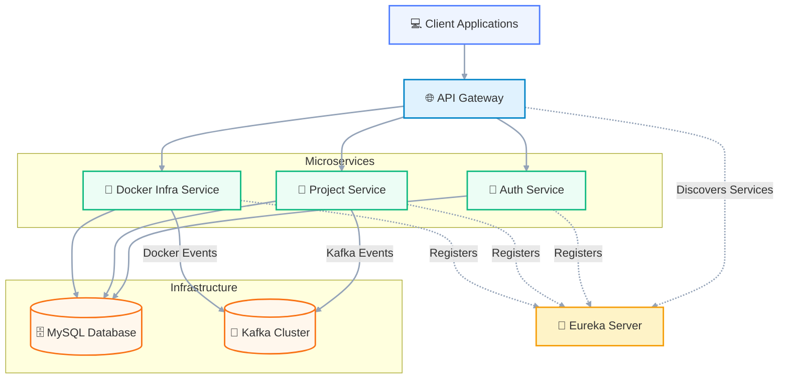

# Nebula DB Microservices

A microservices-based infrastructure management platform built with Spring Boot, Kafka, and Docker. Nebula DB provides a scalable and secure system for managing infrastructure resources, user authentication, and project governance.


## Table of Contents

- [Features](#features)
- [Architecture](#architecture)
- [Tech Stack](#tech-stack)
- [Getting Started](#getting-started)
  - [Prerequisites](#prerequisites)
  - [Installation](#installation)
  - [Running the Application](#running-the-application)
- [API Documentation](#api-documentation)
- [Configuration](#configuration)
- [Deployment](#deployment)
- [Testing](#testing)
- [Contributing](#contributing)
- [License](#license)
- [Contact](#contact)

## Features

- **User Authentication & Authorization** (`nebula-auth`): Secure user registration, login, and JWT-based authentication with role-based access control.
- **Project Management** (`project-service`): Create, manage, and track infrastructure projects and their associated resources.
- **Infrastructure Provisioning** (`docker-infra-service`): Automated provisioning and management of Docker containers and infrastructure resources via Kafka events.
- **Service Discovery & Load Balancing** (`eureka-server`): Centralized service registration and discovery for microservices.
- **API Gateway** (`api-gateway`): Unified entry point for all microservices with JWT authentication, rate limiting, and request routing.
- **Event-Driven Architecture**: Loose coupling between services using Apache Kafka for asynchronous communication.
- **Containerized Deployment**: Fully containerized with Docker Compose for local development and production deployments.
- **Monitoring & Observability**: Integrated with Prometheus, Grafana, and Spring Boot Actuator for metrics and health checks.
- **Secure Communication**: HTTPS-enabled services with JWT token validation and CORS policies.

## Architecture


### Services Overview

| Service | Port | Description |
|---------|------|-------------|
| **nebula-auth** | 8002 | User authentication, authorization, and user management |
| **project-service** | 8000 | Project and infrastructure item management |
| **docker-infra-service** | 8001 | Docker container provisioning and lifecycle management |
| **eureka-server** | 8761 | Service discovery and load balancing |
| **api-gateway** | 8888 | API gateway with authentication, routing, and rate limiting |

## Tech Stack

- **Backend Framework**: Spring Boot 3.3 (Java 26)
- **Service Discovery**: Netflix Eureka
- **API Gateway**: Spring Cloud Gateway
- **Authentication**: JSON Web Tokens (JWT) with Spring Security
- **Event Streaming**: Apache Kafka 3.x
- **Database**: MySQL 8.x
- **Build Tool**: Maven
- **Containerization**: Docker & Docker Compose
- **Testing**: JUnit 5, Mockito, Spring Boot Test
- **CI/CD**: GitHub Actions (Docker Build & Push)

## Getting Started

### Prerequisites

- [Java JDK 26](https://jdk.java.net/26/) or higher
- [Maven 3.8+](https://maven.apache.org/)
- [Docker Engine](https://docs.docker.com/engine/install/) 24.0+
- [Docker Compose](https://docs.docker.com/compose/install/) v2.0+
- [Git](https://git-scm.com/)

### Installation

1. **Clone the repository**:
   ```bash
   git clone https://github.com/parme/nebula-db-microservices.git
   cd nebula-db-microservices
   ```

2. **Set up environment variables**:
   Create a `.env` file in the root directory based on the provided example:
   ```bash
   cp .env.example .env
   ```
   Edit `.env` to set your configuration:
   ```env
   MYSQL_DATABASE=nebuladb
   MYSQL_USERNAME=nebula_user
   MYSQL_PASSWORD=secure_password
   JWT_SECRET_KEY=your_strong_secret_key_here_min_32_chars
   ```

3. **Build the services**:
   ```bash
   ./mvnw clean install -DskipTests
   ```

### Running the Application

#### Using Docker Compose (Recommended)

1. Start all services:
   ```bash
   docker-compose up -d
   ```

2. Wait for all services to be healthy (check with `docker-compose ps`).

3. Access the services:
   - API Gateway: `http://localhost:8888`
   - Eureka Dashboard: `http://localhost:8761`
   - Auth Service API: `http://localhost:8888/api/v1/auth/**`

#### Running Individually (for Development)

Each service can be run independently using Maven:

```bash
# Start Eureka Server
cd cloud/eureka-server
../mvnw spring-boot:run

# Start Auth Service
cd service-infra/nebula-auth
../../mvnw spring-boot:run

# Start Project Service
cd service-infra/project-service
../../mvnw spring-boot:run

# Start Docker Infra Service
cd service-infra/docker-infra-service
../../mvnw spring-boot:run

# Start API Gateway
cd cloud/api-gateway
../../mvnw spring-boot:run
```

## API Documentation

Once the services are running, you can access the API documentation:

- **API Gateway**: `http://localhost:8888/swagger-ui.html` (if Swagger UI is enabled)
- **Auth Service**: `http://localhost:8002/swagger-ui.html`
- **Project Service**: `http://localhost:8000/swagger-ui.html`
- **Docker Infra Service**: `http://localhost:8001/swagger-ui.html`

> Note: Swagger UI endpoints may need to be enabled in each service's `application.yaml` for development.

## Configuration

### Environment Variables

All services use environment variables for configuration. The `.env` file in the root directory is used by Docker Compose. Key variables include:

| Variable | Description | Default |
|----------|-------------|---------|
| `MYSQL_DATABASE` | MySQL database name | `nebuladb` |
| `MYSQL_USERNAME` | MySQL username | `root` |
| `MYSQL_PASSWORD` | MySQL password | `password` |
| `JWT_SECRET_KEY` | Secret key for JWT signing | (Required) |
| `SERVER_PORT` | Port for the service | Service-specific |
| `EUREKA_HOSTNAME` | Eureka server hostname | `eureka-server` |
| `KAFKA_BOOTSTRAP_SERVERS` | Kafka bootstrap servers | `kafka:9092` |

### Service-Specific Configuration

Each service has its own `application.yaml` (or `application.yml`) in `src/main/resources`:

- **nebula-auth**: JWT expiration, password encoding
- **project-service**: Kafka topic names, project validation rules
- **docker-infra-service**: Docker socket path, Kafka consumer groups
- **api-gateway**: Route definitions, CORS settings, rate limits
- **eureka-server**: Peer registry, self-preservation mode

## Deployment

### Production Deployment

For production, we recommend using Kubernetes or Docker Swarm. The provided `docker-compose.yaml` is suitable for development and staging environments.

#### Kubernetes

1. Build and push Docker images:
   ```bash
   ./mvnw spring-boot:build-image -DskipTests
   docker push your-registry/nebula-auth:latest
   # Repeat for all services
   ```

2. Apply Kubernetes manifests:
   ```bash
   kubectl apply -f k8s/
   ```

### Docker Hub Automated Builds

This repository is configured with GitHub Actions to automatically build and push Docker images to Docker Hub on every push to `main`:

- Workflow: `.github/workflows/build-and-push.yml`
- Images are pushed to `docker.io/${DOCKERHUB_USERNAME}/${SERVICE_NAME}:latest`

## Testing

### Unit Tests

Run unit tests for all services:
```bash
./mvnw test
```

### Integration Tests

Integration tests require running dependencies (MySQL, Kafka). Use Docker Compose for testing:
```bash
docker-compose -f docker-compose.yml -f docker-compose.test.yml up -d
./mvnw verify
```

### Testing Guidelines

- Write unit tests for all new code
- Aim for 80%+ code coverage
- Use Testcontainers for integration tests requiring external services
- Follow Arrange-Act-Assert (AAA) pattern
- Mock external dependencies where appropriate

## Contributing

We welcome contributions from the community! Please read our [Contributing Guide](CONTRIBUTING.md) for details on:

- Code of Conduct
- How to report bugs
- How to suggest features
- Pull request process
- Coding standards
- Testing requirements

### Quick Contribution Guide

1. Fork the repository
2. Create a feature branch (`git checkout -b feature/amazing-feature`)
3. Make your changes
4. Commit your changes (`git commit -m 'Add amazing feature'`)
5. Push to the branch (`git push origin feature/amazing-feature`)
6. Open a Pull Request

Please ensure your PR includes:
- Clear description of changes
- Relevant tests
- Updated documentation (if applicable)
- Passing CI checks

## License

This project is licensed under the MIT License - see the [LICENSE](LICENSE) file for details.

## Contact

Parmeet - [@parmeet](https://github.com/parme)

Project Link: [https://github.com/parme/nebula-db-microservices](https://github.com/parme/nebula-db-microservices)

## Acknowledgments

- Spring Boot team for the excellent framework
- Apache Kafka team for the robust streaming platform
- Netflix OSS for Eureka and other cloud-native tools
- Docker team for containerization excellence
- JetBrains for IntelliJ IDEA (used in development)